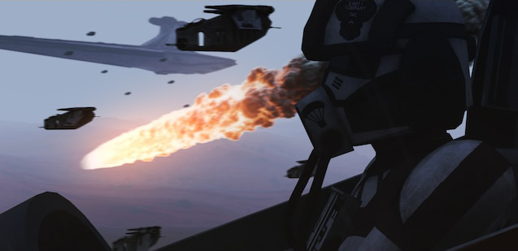
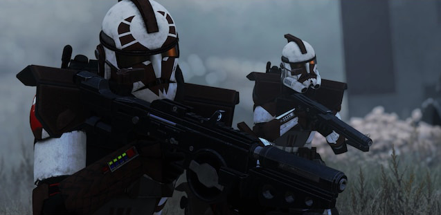

<h1 style="border-bottom: none"> Keeli Company Aux Mod </h1>

<h3>

[Homepage](https://www.keelicompany.com/) | [Discord](https://discord.gg/ZKPt3GjxQC) | [Changelogs](https://discord.com/channels/397600745173549057/1025651724310024252) | [A3 Units Page](https://units.arma3.com/unit/kckeelicompany)

</h3>

---
 
 

**This page is a work-in-progess**, excuse the placeholder text!

Unit description
 
 

--- 

## Detachments

Keeli Company has several platoons to fit the play styles of its members. Letting people play the way they want to.

### Nightfall

Infantry

### Blurrgg

</img>

Aviation

### Reeker

Armored

### Spartan & Raptor

</img>

Special Forces (ARC/ARF)

## Communication System for Deaf & Mute Players
Keeli Company does what it can to meet the needs of players because everyone deserves the ability to play. The original system was created by Mithu Ral (`jenenna985` on [Discord](https://discord.com/)) of the [House Kandosii](https://discord.com/invite/KPRMagqwAc) Arma 3 unit, but allows their code to be used freely. This system was then expanded upon for further functionality.

This system is packed together with the [Keeli Company Aux Mod](https://steamcommunity.com/sharedfiles/filedetails/?id=2791896289) but is also included as a separate mod download for other groups to use freely.

**This system is a work-in-progress, and is currently not public *yet*.**

## Completely Custom Weapons and Equipment
The Keeli Company aux implements weapons and equipment that haven't gotten as much attention as others from Star Wars, as well as completely new ones.

### Droid Poppers
EMP Greandes or "Droid Poppers" as republic troopers often called them, are small grenades that release a large burst of energy to disrupt electrical systems. This burst can completely disable simple B1 Battledroids, but only temporarily disables much more resiliant foes such as Droidekas or AATs. The shields of droidekas absorb most of the energy, overloading the shield but leaving the droideka itself perfectly fine.

Showcase video for droid poppers
<!--  -->

### Deployable Medical Droids
A poweful tool meant for assisting Clone Medics on the front lines. The DX-8 medical droid, the upgrade to the still common DX-7 version, helps deal with mass casuality scenarios by administiring medical aid to lighter injuries, letting medics focus on the more pressing patients.

The DX-8 medical droid also instructs standard Clone Troopers how to treat their own injuries and the injuries of those around them. This lets Troopers handle the less critical wounds by stitching themselves and those around them.

Showcase video for medical droid
<!--  -->