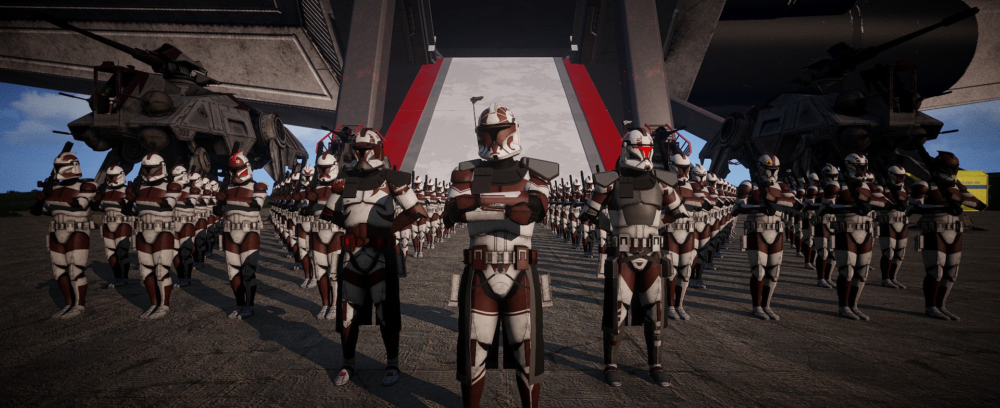
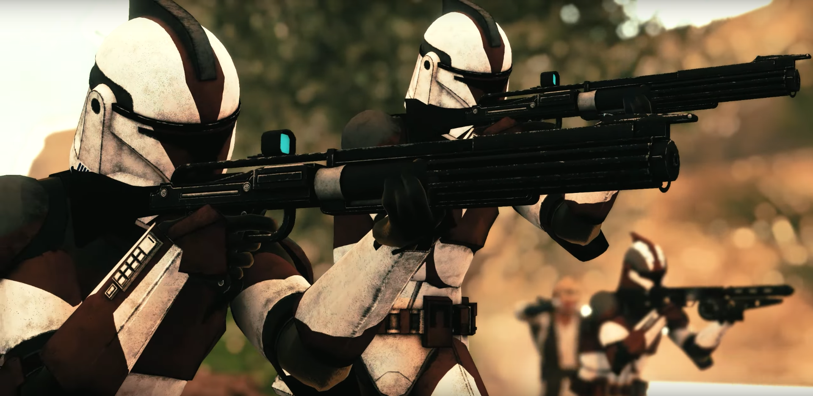
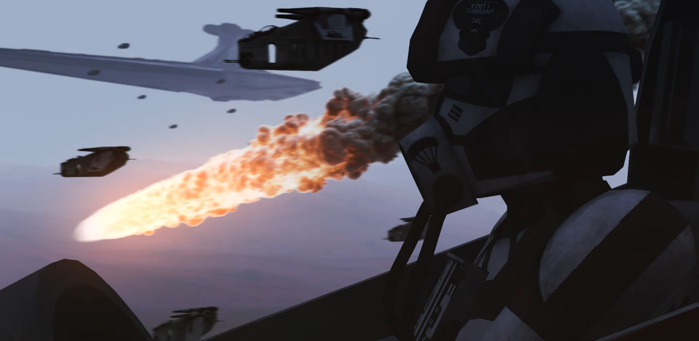
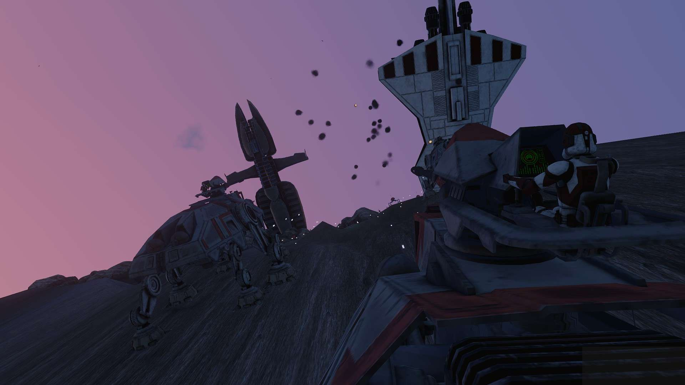
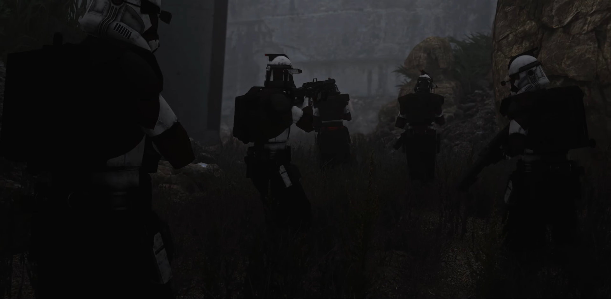
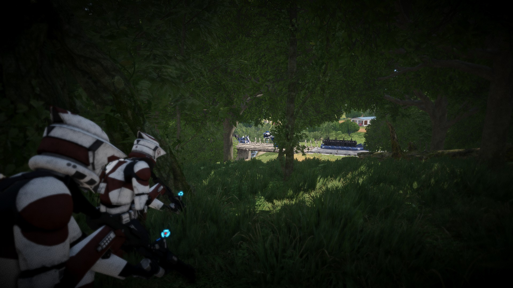

  <ul>
    
<h1 style="display: inline-block;">Keeli Company Aux Mod</h1> 
    Version 2.53.2 
    *

  </ul>

<h3>

[Homepage](https://www.keelicompany.com/) | [Discord](https://discord.gg/ZKPt3GjxQC) | [Changelogs](https://ptb.discord.com/channels/397600745173549057/1126550349650591896) | [A3 Units Page](https://units.arma3.com/unit/kckeelicompany)

</h3>

---
 
 

***All custom assets, scripts, etc. are licensed under APL-ND**. While containing original assets, this mod also includes re-uploads of other content with permission from their original authors.

If an addon contains re-uploaded or modified content, it will be noted in a `LICENSE.md` file located in that addon.

If you would like to reupload content from the Keeli Company aux mod, leave a comment in the [Reuploading Content from the Keeli Company Aux Mod](https://github.com/Outer-Rim-Armory/Aux-Mod/discussions/223) discussion post. **Asking does not guarentee a yes. Reuploading and not asking guarentees a DMCA.**
 

---

## Mod Features
The Keeli Company Aux mod focuses on creating custom and in-depth systems, as well as the standard features you would find in other unit aux mods such as custom textured equipment; vehicles; and balance tweaks. Each of these systems has a document outlining how to use that particular system.

- **[Main](./addons/core/README.md)**
- [Armor](./addons/armor/README.md)
- [Chat Wheel](./addons/chat_wheel_redux/README.md)
- [Creatures](./addons/creatures/README.md)
- [Custom Armor](./addons/creatures/README.md)
- [Droids](./addons/droids/README.md)
- [Fortify](./addons/fortify/README.md)
- [Gonk Droids](./addons/gonks/README.md)
- [Intercom](./addons/intercom/README.md)
- [Jetpacks](./addons/jetpacks/README.md)
- [Map](./addons/map/README.md)
- [Medical](./addons/medical/README.md)
- [Radio Jammers](./addons/jammers/README.md)
- [Screenshot Mode](./addons/screenshotmode/README.md)
- [Suppress](./addons/suppress/README.md)
- [Vehicle Shields](./addons/shields/README.md)
- [Vehicle Systems](./addons/vehicles/README.md)
- [Weapon Systems](./addons/weapons/README.md)

## Detachments

Keeli Company has several platoons to fit the play styles of its members, letting people play the way they want to.

### Nightfall

</img>

Infantry

### Blurrgg

</img>

Aviation

### Reeker

</img>

Armored

### Spartan

</img>

ARC

### Raptor

</img>

ARF

## Communication System for Deaf Players
Keeli Company does what it can to meet the needs of players because everyone deserves the ability to play. The original system was created by Mithu Ral (`jenenna985` on [Discord](https://discord.com/)), but allows their code to be used freely. This system was then completely rewritten and updated for more functionality and features.

This system is packed together with the [Keeli Company Aux Mod](https://steamcommunity.com/sharedfiles/filedetails/?id=2791896289) but is also included as a [separate mod download](https://steamcommunity.com/sharedfiles/filedetails/?id=3005504621) for other groups to use freely. You can find the original mod [created by Jenna here](https://github.com/DartRuffian/A3-ChatWheel).

    

